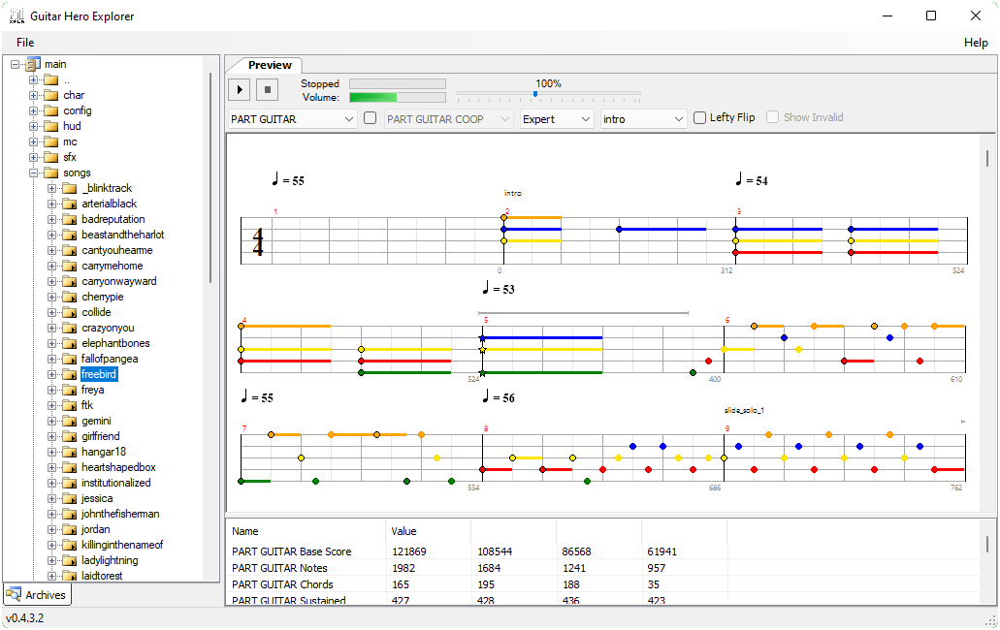

# Guitar Hero Explorer
This is a decompiled version of Guitar Hero Explorer by katamakel (found on [ScoreHero](https://www.scorehero.com/forum/viewtopic.php?t=2549)). It was one of the first fan made programs created to import custom songs into the Guitar Hero PS2 games.

# System Requirements
- Windows 7 or above
- .NET Framework 4.6.2

# Changes
- Fix audio playback on Windows 10
- Fix GH80s archive import
- Parse alpha color channel for textures
- Increase max playback rate to 200%
- Preserve fullscreen state in user settings

Please see provided [changelog](ghex/ChangeLog.txt) for complete list

# Known Issues
- Opening GH2 Xbox 360 archive no longer works

Extensive testing of features has not been done so any reports of broken behavior is welcome